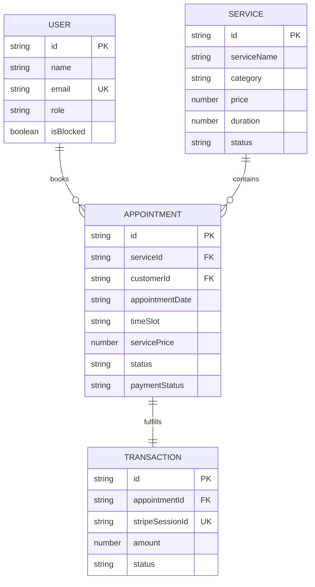

# MongoDB Database Architecture

```mermaid
erDiagram
    USER ||--o{ APPOINTMENT : books
    SERVICE ||--o{ APPOINTMENT : contains
    APPOINTMENT ||--|| TRANSACTION : fulfills

    USER {
        string id PK
        string name
        string email UK
        string role
        boolean isBlocked
    }

    SERVICE {
        string id PK
        string serviceName
        string category
        number price
        number duration
        string status
    }

    APPOINTMENT {
        string id PK
        string serviceId FK
        string customerId FK
        string appointmentDate
        string timeSlot
        number servicePrice
        string status
        string paymentStatus
    }

    TRANSACTION {
        string id PK
        string appointmentId FK
        string stripeSessionId UK
        number amount
        string status
    }
```
